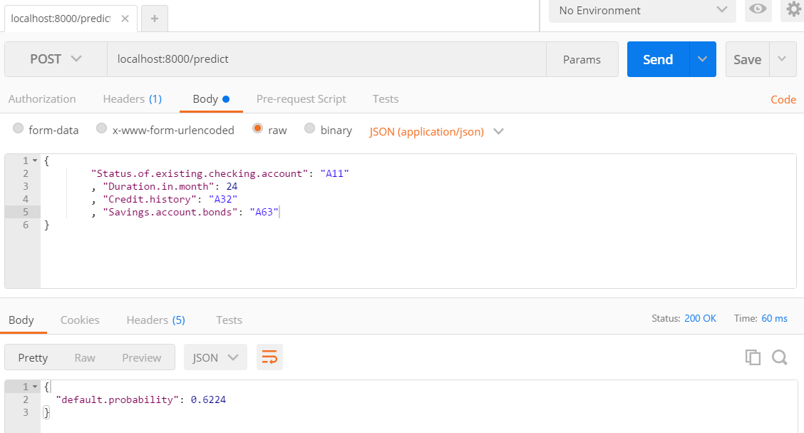

##What is a RESTful API?

Wait, wait, wait, RESTful what? What are APIs and RESTful APIs? Are they different?

API(Application Program Interface) is a generic term and can really mean any interface an IT service promises to other services. For instance, the below Python function written below requires to input variables a and b. The fact it takes in two variables is an API.

`def sum(a, b):`
    `return a + b`

RESTful API(REpresentational State Transfer-ful API) is a type of API. I hate the name because it does not clearly say what type of an API it is. Essentially, RESTful APIs are HTTP APIs (and I hope that HTTP sounds more familiar than RESTful). RESTful APIs use the HTTP as their common interface. At a bare minimum, the HTTP looks for two things: method and URL. For example, when you came to this web page to read our blog post, you (or your web browser conveniently) made a request to our web server with the GET method and the URL you see in your web browser. Our web server knows how to interpret your HTTP request and thus you can see our blog post at this moment.

##How to create RESTful APIs in R using open source libraries?

###First, create a machine learning model

To make our example a bit more interesting, let us create a machine learning model in the simplest manner possible. I have worked with an online lending company before so let us create a model that predicts whether a person is going to pay off a loan using the famous German credit data. Building a predictive model is a sophisticated process of combining arts, science and specialized business knowledge; however, in this example, we will build it without worrying too much about all these details for the sake of simplicity.
```{r}
url <- "https://archive.ics.uci.edu/ml/machine-learning-databases/statlog/german/german.data"
col.names <- c(
  'Status of existing checking account', 'Duration in month', 'Credit history'
  , 'Purpose', 'Credit amount', 'Savings account/bonds'
  , 'Employment years', 'Installment rate in percentage of disposable income'
  , 'Personal status and sex', 'Other debtors / guarantors', 'Present residence since'
  , 'Property', 'Age in years', 'Other installment plans', 'Housing', 'Number of existing credits at this bank'
  , 'Job', 'Number of people being liable to provide maintenance for', 'Telephone', 'Foreign worker', 'Status'
)
# Get the data
data <- read.csv(
  url
  , header=FALSE
  , sep=' '
  , col.names=col.names
)
 
library(rpart)
# Build a tree
# I already figured these significant variables from my first iteration (not shown in this code for simplicity)
decision.tree <- rpart(
  Status ~ Status.of.existing.checking.account + Duration.in.month + Credit.history + Savings.account.bonds
  , method="class"
  , data=data
)
 
#install.packages("rpart.plot")
library(rpart.plot)
# Visualize the tree
# 1 is good, 2 is bad
prp(
  decision.tree
  , extra=1
  , varlen=0
  , faclen=0
  , main="Decision Tree for German Credit Data"
)
```

So I looked up what these A13, A14, A32, A33, A34, A64 and A65 mean:

- A13: Checking account balance >= 200 DM or salary assignments for at least 1 year
- A14: No checking account
- A32: Existing credits paid back duly till now
- A33: Delay in paying off in the past
- A34: Critical account / other credits existing (not at this bank)
- A64: Savings account balance >= 1000 DM
- A65: Unknown/ no savings account.

Interpreting the tree:
1. If a customer has no marginal amount of money in his checking account or does not have a checking account at all, then he is likely to be in good standing (1 means good, 2 means bad)
2. If a customer has only a small amount of money in his checking account, the loan duration is greater than or equal to 22, and also has only insignificant amount of fund in his savings account, he is more than likely to default. Does it make sense in your own terms? (By the way, the data was still using the old currency Deutsche Mark; how old is this data?) 
3. The second-deep, left-most node? Some customers in this node had delays in paying off in the past or credits in other banks but will be categorized as good in this decision tree.

Should we always trust when someone says “we machine-analyzed this data and the error rate is minimized - we should believe what it predicts!”

###Predict using the machine learning credit model

What’s the use of a predictive model if we don’t predict? Let us make some predictions using the credit model we just created:
```{r}
new.data <- list(
  Status.of.existing.checking.account='A11'
  , Duration.in.month=20
  , Credit.history='A32'
  , Savings.account.bonds='A65'
)
predict(decision.tree, new.data)
```

###Save it

Let us save the model to our hard disk so we can use it in our RESTful API:
```{r}
save(decision.tree, file='decision_Tree_for_german_credit_data.RData')
```

###Use the R package Plumber to create a RESTful API

So now is time to make a RESTful API for our credit model. We will use Plumber, an open source package in R that provides easy ways to create a RESTful API for programs written in R.

Following their examples, we can create a script like below to create a web API for our credit model:
```{r}
library(rpart)
library(jsonlite)
load("decision_Tree_for_german_credit_data.RData")
 
#* @post /predict
predict.default.rate <- function(
  Status.of.existing.checking.account
  , Duration.in.month
  , Credit.history
  , Savings.account.bonds
) {
  data <- list(
    Status.of.existing.checking.account=Status.of.existing.checking.account
    , Duration.in.month=Duration.in.month
    , Credit.history=Credit.history
    , Savings.account.bonds=Savings.account.bonds
  )
  prediction <- predict(decision.tree, data)
  return(list(default.probability=unbox(prediction[1, 2])))
}
```

Then save the file (I named it deploy_ml_credit_model.R) and run the following command in an R environment such as the Console window in RStudio.

```{r}
# For the first time, you many need to install the plumber package by typing:
# install.packages("plumber")
 
library(plumber)
r <- plumb("deploy_ml_credit_model.R")
r$run(port=8000)
```

Then **boom** you just made your first RESTful API running R machine learning model! It is running on your localhost on port 8000.

###Test to make sure it works

Let us see it works by issuing the following command in a terminal:

` curl -X POST -d '{"Status.of.existing.checking.account": "A11", "Duration.in.month": 24, "Credit.history": "A32", "Savings.account.bonds": "A63"}' -H 'Content-Type: application/json' localhost:8000/predict `

You will get: `{"default.probability":0.6224}` Hooray! Your decision tree model just responded!

Postman as a better alternative to test RESTful APIs. Follow their instruction on installation. Then you can request to your API and get a response like below:


